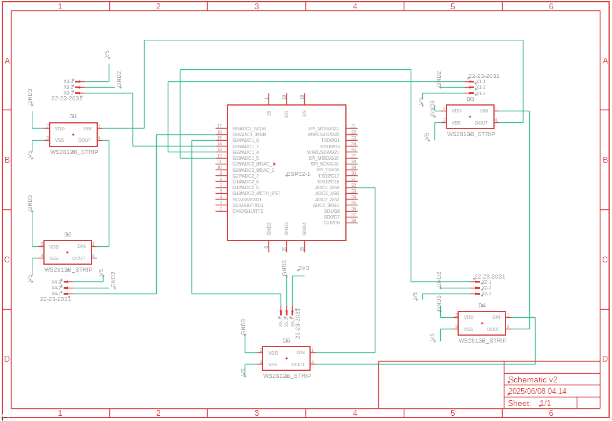

# Mic Subsystem — ESP32 + Analog Mics + WS2812 Visualiser

This project uses an ESP32 to read audio signals from **5 analog microphones**, processes each signal with **KISS FFT**, and visualises the **dominant frequency and amplitude** using a strip of **WS2812 RGB LEDs**.

Each LED corresponds to one mic and changes colour based on the peak frequency, and brightness based on magnitude.

---

## Components

### Hardware

- [ESP32 WROOM](https://www.espressif.com/en/products/socs/esp32) (38-pin dev board)
- 5× Analog microphones (e.g. KY-38)
- 5× WS2812B addressable RGB LEDs (5mm or strip form)
- Breadboard & jumper wires

### Software

- [Arduino IDE](https://www.arduino.cc/en/software)
- [KissFFT](https://github.com/mborgerding/kissfft)
- [FastLED](https://github.com/FastLED/FastLED)

---

## Circuit Diagram

Here is the hardware schematic showing how the microphones and WS2812 LEDs connect to the ESP32:

<p align="center">
  
</p>

> **Each microphone** connects to its own **ADC pin** on the ESP32.  
> **All LEDs** share a **single digital output pin**.

| Mic # | ADC Pin | LED Index |
| ----- | ------- | --------- |
| 1     | GPIO 34 | 0         |
| 2     | GPIO 35 | 1         |
| 3     | GPIO 32 | 2         |
| 4     | GPIO 33 | 3         |
| 5     | GPIO 39 | 4         |

LEDs (WS2812B) are connected in series and controlled via **GPIO 4**.

---

## Getting Started

### 1. Clone the Repo

```bash
git clone https://github.com/your-username/mic-subsystem.git
cd mic-subsystem
```

### 2. Install Libraries

In the **Arduino IDE**:

- Open the Library Manager (`Ctrl + Shift + I`)
- Search for and install:
  - **FastLED** by Daniel Garcia

For **KissFFT**:

- Download the [KissFFT source code](https://github.com/mborgerding/kissfft)
- Copy `kiss_fft.c`, `kiss_fft.h`, `kiss_fftr.c`, `kiss_fftr.h` into the sketch folder
- locate and delete.

```bash
Arduino/libraries/FastLED/src/third_party/cq_kernel/kiss_fft.c
Arduino/libraries/FastLED/src/third_party/cq_kernel/kiss_fftr.c


```

### 3. Open and Upload

- Open `Mic_2.ino` in Arduino IDE
- Connect your ESP32
- Select the correct **board** and **port**
- Upload the sketch

---

## How It Works

- Each mic captures ambient sound via ADC
- A **notch filter** removes 50/60Hz hum
- FFT is applied to detect the **peak frequency**
- LED hue = frequency
- LED brightness = magnitude

Example:

| Frequency | Colour | Magnitude | Brightness |
| --------- | ------ | --------- | ---------- |
| 200 Hz    | Red    | High      | Bright     |
| 1000 Hz   | Green  | Low       | Dim        |
| 3000 Hz   | Purple | Medium    | Mid        |

---

## Visualisation

Use the **Serial Plotter** in Arduino IDE to see raw & filtered waveform data for each mic.  
Each LED gives a live visual feedback of its assigned mic.

---

## Folder Structure

```
mic-subsystem/
├── Mic_2.ino
├── kiss_fft.c
├── kiss_fft.h
├── kiss_fftr.c
├── kiss_fftr.h
├── README.md
```

---

## Credits

- [KissFFT](https://github.com/mborgerding/kissfft) by Mark Borgerding
- [FastLED](https://github.com/FastLED/FastLED) by Daniel Garcia and contributors

---
